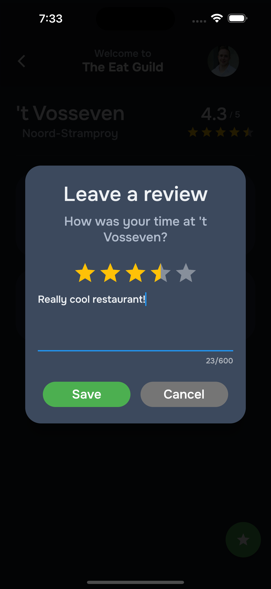

[![Contributors][contributors-shield]][contributors-url]
[![Forks][forks-shield]][forks-url]
[![Stargazers][stars-shield]][stars-url]
[![Issues][issues-shield]][issues-url]
[![MIT License][license-shield]][license-url]
[![LinkedIn][linkedin-shield]][linkedin-url]

<!-- PROJECT LOGO -->
 

  

<h3 align="center">Rib Reviews</h3>

  

    Serverless Next.js backend + Flutter mobile app that allows users to rate their favourite restaurants.
     
    <a href="https://github.com/jordyvanvorselen/rib-reviews"><strong>Explore the docs »</strong></a>
     
     
    <a href="https://github.com/jordyvanvorselen/rib-reviews">View Demo</a>
    ·
    <a href="https://github.com/jordyvanvorselen/rib-reviews/issues">Report Bug</a>
    ·
    <a href="https://github.com/jordyvanvorselen/rib-reviews/issues">Request Feature</a>
  

<!-- TABLE OF CONTENTS -->

  
Table of Contents

  <ol>
    <li>
      <a href="#about-the-project">About The Project</a>
      <ul>
        <li><a href="#built-with">Built With</a></li>
      </ul>
    </li>
    <li><a href="#getting-started">Getting Started</a></li>
    <li><a href="#usage">Usage</a></li>
    <li><a href="#roadmap">Roadmap</a></li>
    <li><a href="#contributing">Contributing</a></li>
    <li><a href="#license">License</a></li>
    <li><a href="#contact">Contact</a></li>
  </ol>

<!-- ABOUT THE PROJECT -->

## About The Project

<a href="https://github.com/jordyvanvorselen/rib-reviews">
  
  
  
  
   
   
</a>

Rib reviews is a Flutter mobile app backed by a Serverless Next.js backend hosted on Vercel.

- Click [here](./frontend/README.md) to read more about the technical setup of the **mobile app**.
- Click [here](./backend/README.md) to read more about the technical setup of the **backend**.

(<a href="#readme-top">back to top</a>)

### Built With

- [![Next][next.js]][next-url]
- [![React][react.js]][react-url]
- [![Flutter][flutter]][flutter-url]
- [![Vercel][vercel]][vercel-url]

(<a href="#readme-top">back to top</a>)

<!-- GETTING STARTED -->

## Getting Started

This project is set up in two main folders. The `frontend` folder contains the Flutter mobile app, and the `backend` folder contains the Next.js backend. They both contain their own respective setup instructions.

- Click [here](./frontend/README.md) to read more about the technical setup of the **mobile app**.
- Click [here](./backend/README.md) to read more about the technical setup of the **backend**.

(<a href="#readme-top">back to top</a>)

<!-- ROADMAP -->

## Roadmap

- [x] Plan events
- [x] Rate restaurants
- [ ] React on restaurant ratings using emoji's
- [ ] Vote for upcoming restaurants

See the [open issues](https://github.com/jordyvanvorselen/rib-reviews/issues) for a full list of proposed features (and known issues).

(<a href="#readme-top">back to top</a>)

<!-- CONTRIBUTING -->

## Contributing

Contributions are what make the open source community such an amazing place to learn, inspire, and create. Any contributions you make are **greatly appreciated**.

If you have a suggestion that would make this better, please fork the repo and create a pull request. You can also simply open an issue with the tag "enhancement".
Don't forget to give the project a star! Thanks again!

1. Fork the Project
2. Create your Feature Branch (`git checkout -b feature/amazing-feature`)
3. Commit your Changes (`git commit -m 'Add some AmazingFeature'`)
4. Push to the Branch (`git push origin feature/amazing-feature`)
5. Open a Pull Request

(<a href="#readme-top">back to top</a>)

<!-- LICENSE -->

## License

Distributed under the GPLv3 License. See `LICENSE` for more information.

(<a href="#readme-top">back to top</a>)

<!-- CONTACT -->

## Contact

Jordy van Vorselen - [@jordyvanvorselen](https://twitter.com/jordyvanvorselen) - jordyvanvorselen@gmail.com

Project Link: [https://github.com/jordyvanvorselen/rib-reviews](https://github.com/github_username/repo_name)

(<a href="#readme-top">back to top</a>)

<!-- MARKDOWN LINKS & IMAGES -->
<!-- https://www.markdownguide.org/basic-syntax/#reference-style-links -->

[contributors-shield]: https://img.shields.io/github/contributors/jordyvanvorselen/rib-reviews.svg?style=for-the-badge
[contributors-url]: https://github.com/jordyvanvorselen/rib-reviews/graphs/contributors
[forks-shield]: https://img.shields.io/github/forks/jordyvanvorselen/rib-reviews.svg?style=for-the-badge
[forks-url]: https://github.com/jordyvanvorselen/rib-reviews/network/members
[stars-shield]: https://img.shields.io/github/stars/jordyvanvorselen/rib-reviews.svg?style=for-the-badge
[stars-url]: https://github.com/jordyvanvorselen/rib-reviews/stargazers
[issues-shield]: https://img.shields.io/github/issues/jordyvanvorselen/rib-reviews.svg?style=for-the-badge
[issues-url]: https://github.com/jordyvanvorselen/rib-reviews/issues
[license-shield]: https://img.shields.io/github/license/jordyvanvorselen/rib-reviews.svg?style=for-the-badge
[license-url]: https://github.com/jordyvanvorselen/rib-reviews/blob/master/LICENSE
[linkedin-shield]: https://img.shields.io/badge/-LinkedIn-black.svg?style=for-the-badge&logo=linkedin&colorB=555
[linkedin-url]: https://linkedin.com/in/jordy-van-vorselen
[next.js]: https://img.shields.io/badge/next.js-000000?style=for-the-badge&logo=nextdotjs&logoColor=white
[next-url]: https://nextjs.org/
[react.js]: https://img.shields.io/badge/React-20232A?style=for-the-badge&logo=react&logoColor=61DAFB
[react-url]: https://reactjs.org/
[flutter]: https://img.shields.io/badge/flutter-000000?style=for-the-badge&logo=flutter&logoColor=blue
[flutter-url]: https://flutter.dev/
[vercel]: https://img.shields.io/badge/vercel-000000?style=for-the-badge&logo=vercel&logoColor=white
[vercel-url]: https://vercel.com/
